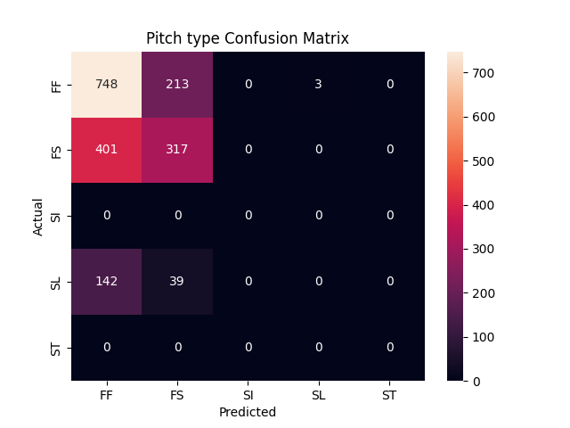
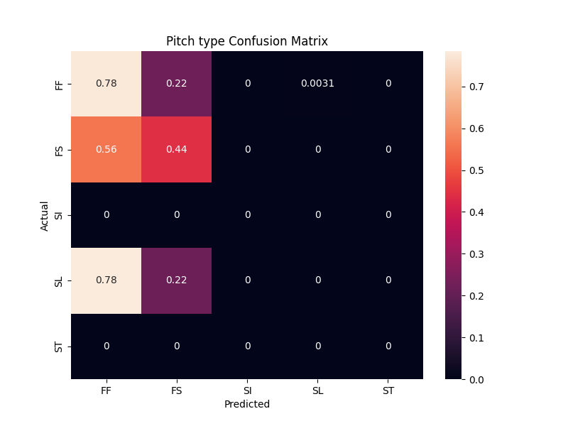
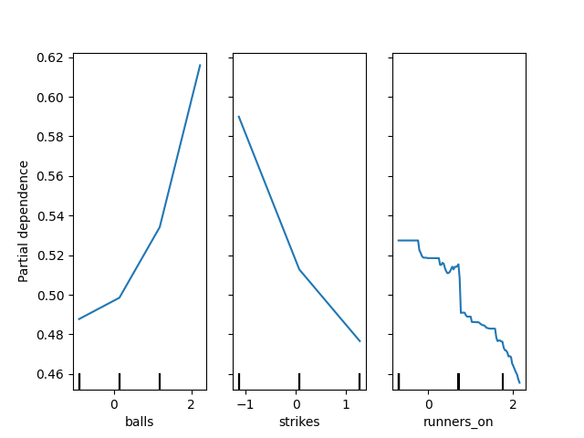
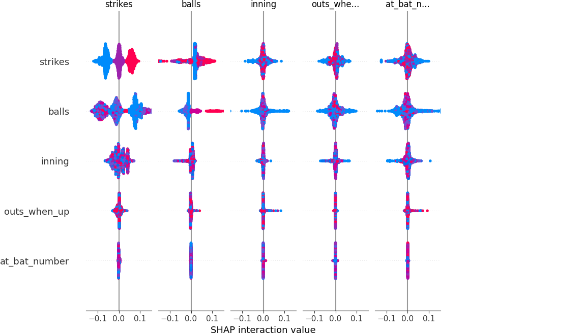

# Random Forest Classifier
These are the statistics for what seem to be the best model so far (~57% accuracy):

```
accuracy: 0.571658615136876
              precision    recall  f1-score   support

          FF       0.58      0.78      0.66       964
          FS       0.56      0.44      0.49       718
          SL       0.00      0.00      0.00       181

    accuracy                           0.57      1863
   macro avg       0.38      0.41      0.39      1863
weighted avg       0.51      0.57      0.53      1863

Top-2 Accuracy: 0.922
at_bat_number                       0.112984
prev_release_spin_rate              0.111095
prev_release_speed                  0.110745
runners_on                          0.101001
run_diff                            0.075147
strikes                             0.068967
balls                               0.064043
inning                              0.056227
pitch_number                        0.051493
outs_when_up                        0.037449
stand_R                             0.028325
stand_L                             0.026946
prev_pitch_type_lag1_NoPrevPitch    0.018476
prev_pitch_type_lag1_FS             0.017566
prev_pitch_type_lag2_NoPrevPitch    0.016071
dtype: float64
```




Permutation Importance:
```
strikes                             0.021632
balls                               0.016532
runners_on                          0.011755
prev_release_speed                  0.011594
prev_pitch_type_lag1_FF             0.011111
prev_pitch_type_lag3_NoPrevPitch    0.009018
outs_when_up                        0.005529
prev_pitch_type_lag2_NoPrevPitch    0.005529
prev_release_spin_rate              0.004777
prev_pitch_type_lag3_FF             0.004133
pitch_number                        0.003918
prev_pitch_type_lag2_FS             0.003060
prev_pitch_type_lag2_FF             0.002576
inning                              0.002093
prev_pitch_type_lag1_SL             0.001771
prev_pitch_type_lag3_FS             0.001664
stand_R                             0.000966
prev_pitch_type_lag2_SL             0.000805
prev_pitch_type_lag1_NoPrevPitch    0.000483
prev_pitch_type_lag1_FS             0.000107
prev_pitch_type_lag3_SI             0.000000
prev_pitch_type_lag3_ST             0.000000
prev_pitch_type_lag1_ST             0.000000
prev_pitch_type_lag2_ST             0.000000
prev_pitch_type_lag2_SI             0.000000
prev_pitch_type_lag1_SI             0.000000
p_throws_R                          0.000000
stand_L                            -0.000429
run_diff                           -0.000966
prev_pitch_type_lag3_SL            -0.001932
at_bat_number                      -0.003221
```

Partial Dependence Plot for FF


As the number of balls increases, the probability of throwing a 4-seam fastball increases.
As strikes increase, less probable to throw a fastball. 

SHAP Analysis for key features:


This indicates that the model understands one-dimensional effects:
- Balls ↑ → FF ↑ 
- Strikes ↑ → FF ↓
- runners_on ↑ → FF ↓

but not a combination of these factors. This seems to be a weakness of the random
forest classifier, indicates that the model should be changed. 

**Final baseline comparisons**:

- Baseline Accuracy: 0.5174

- Last Pitch Baseline Accuracy: 0.3752012882447665

- Count-only model accuracy:  0.546430488459474

This means that the best model accuracy seen (~57%) was slightly better than a simple Logistic Regression model
based on the count. 

